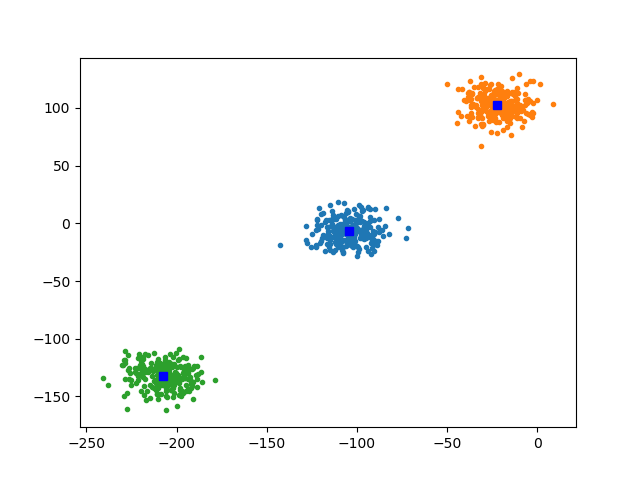

# Learning about Parallelism, Testing, and Build Systems
Kawin Nikomborirak, Siddharth Garimella, Sreekanth Sajjala

## Project Goals
Our goal for the project was to understand low-level optimization in C
by exploring kmeans.  To do this, our tool of emphasis was parallelism
via the POSIX threading library pthread and the semaphore library
semaphore.  Since this would be a collaborative project, we also set
out to explore various tools for project management, such as build
systems (CMake), CI (travis), and unit testing (Google Tests).  The
deliverable includes a graph showing a successful clustering exercise
as well as tabulated runtimes between four implementations: SciPy’s,
our single threaded one, our multi-threaded one, and our CUDA
implementation. Another deliverable is a successful Travis build
check.

## Learning Goals
Our goal for this project was originally to make something fast,
namely K-means via parallelization. While creating the project,
though, many welcome distractions arose, such as wanting to assure
that everyone’s code worked when committed and needing to develop for
a GPU platform on a machine without a GPU. With one of us working on a
windows machine and the rest of us working from Linux machines, CMake
became a natural option to keep track of build options. The learning
goals became being able to make performant code with C while also
learning how to deal with cross-platform and cross-developer code.

## Deliverables

By the end of the project we were able to get all 3 versions of the
function up and running. As we expected our characterization of the
algorithm's performance among single threaded, multi threaded, and 
GPU implementations to change with the number of points used,
we tried timing the executions once with 768 points, and again with
30,000 points. This provides us with some basic insight as to
how our different implementations scale.


### 768 points

We clocked the single threaded K-Means at
10ms, the multithreaded one at 4ms and the CUDA implementation at
xms. We compared the runtimes to the scipy implementation of K means
on python. Here is the runtime table.

| Method                     | Time (ms) | Correct |
|----------------------------|-----------|---------|
| `scipy.cluster.vq.kmeans`  | 6         | ✓       |
| single thread              | 4         | ✓       |
| multi threaded (8 threads) | 3         | ✓       |
| GPU (NVidia 930 MX)        | 0.3       | ✓       |

The data was generated using [this python script](../src/random_clusters.py).
All of the implementations clustered the points correctly as shown below:


### 30,000 points

We clocked the single threaded K-Means at
8 ms, the multithreaded one at 3 ms and the CUDA implementation at
2.2ms. We compared the runtimes to the scipy implementation of K means
on python. Here is the runtime table.

| Method                     | Time (ms) | Correct |
|----------------------------|-----------|---------|
| `scipy.cluster.vq.kmeans`  | 50        | ✓       |
| single thread              | 8         | ✓       |
| multi threaded (8 threads) | 3         | ✓       |
| GPU (NVidia 930 MX)        | 2.2       | ✓       |

Again, all scripts reached the same clusters here:


The punchline parts of all four implementations are discussed below:


### Python
Since we did not have to write it, testing the python implementation was easy:

``` python
POINTS = whiten(np.genfromtxt("random_clusters.csv", delimiter=","))
WHITENED = whiten(POINTS)
time = timeit.timeit(lambda: kmeans(WHITENED, 3), number=1)
print(time)
```

### Single Threaded and Multi Threaded
The multi-threaded implementation was parallelized over the distance calculation for all points to a single cluster center so the bulk of the code is the same.
The only difference is how `distanceSquareds`, the function which returns the distances of every point from a cluster center, is defined.

The algorithm for a single iteration breaks down as:

1. Create a 2D array of distances from all points to all centers
2. Create a 1D array containing the index of the closest center to each point.
3. Use the above array to average the points within the proximity of each cluster.

``` c
void kmeans_iteration(Point *points, Point *centers, int num_pts,
                      int num_centers) {
  double distances[num_centers][num_pts];

  // Compute distances of all points from all centers
  for (int i = 0; i < num_centers; ++i)
    distanceSquareds(centers[i], points, num_pts, distances[i]);

  // Store the index of the closest center to all points
  int min_idxs[num_pts];

  for (int i = 0; i < num_pts; ++i) {
    min_idxs[i] = 0;
    for (int j = 1; j < num_centers; ++j)
      if (distances[min_idxs[i]][i] > distances[j][i])
        min_idxs[i] = j;
  }

  int cluster_size[num_centers];
  Point cluster_total[num_centers];

  // Initialize arrays as 0;
  for (int i = 0; i < num_centers; ++i) {
    cluster_size[i] = 0;
    Point tmp = {0};
    cluster_total[i] = tmp;
  }

  // Add up the points in each cluster
  for (int i = 0; i < num_pts; ++i) {
    cluster_size[min_idxs[i]]++;
    cluster_total[min_idxs[i]] =
        add_point_point(cluster_total[min_idxs[i]], points[i]);
  }

  // Average the points in each cluster
  for (int i = 0; i < num_centers; ++i)
    if (cluster_size[i] != 0)
      centers[i] = divide_point_int(cluster_total[i], cluster_size[i]);
}
```

The function which repetitively calls the iterations is:

``` c
Point *kmeans(Point *points, int num_pts, int num_centers) {
  ...
  do {
    kmeans_iteration(points, centers, num_pts, num_centers);
    center_change = 0;

    for (int i = 0; i < num_centers; ++i)
      center_change += distanceSquared(centers[i], centers_prev[i]);

    memcpy(centers_prev, centers, sizeof(Point) * num_centers);
  } while (center_change > 1e-8);

  return centers;
}
```

The implementation of the single threaded `distanceSquareds` function was trivial, as it is a for loop which adds up the squares of the coordinate differences.
However, the implementation of the multithreaded function was more involved.
The first order of business is to create a thread that carries out the required task.
The tricky part is that each thread must lock until the appropriate portion of the points to handle is assigned.
Otherwise, the first two calls of a function may end up handling the same portion of the points leaving the last portion untaken.
Therefore, we had to use a semaphore which is locked before calling the thread and unlocked while the thread is running:

``` c
void *calc_distances_thread(void *arg) {
  const ThreadArgs *thread_args = (ThreadArgs *)arg;
  const int part = thread_args->part_;
  // Unlock the thread
  sem_post(thread_args->mutex);

  int idx;

  // This part simply schedules the amount of points, handled by each thread,
  // such that all threads handle either n or n+1 points and the threads that
  // start first take n+1 points.
  if (part < thread_args->rem_)
    for (int i = 0; i <= thread_args->base_sz_; ++i) {
      idx = i + part * (thread_args->base_sz_ + 1);
      thread_args->distances_[idx] =
          distanceSquared(thread_args->origin_, thread_args->points_[idx]);
    }
  else
    for (int i = 0; i < thread_args->base_sz_; ++i) {
      idx = thread_args->rem_ * (thread_args->base_sz_ + 1) +
            (part - thread_args->rem_) * thread_args->base_sz_ + i;
      thread_args->distances_[idx] =
          distanceSquared(thread_args->origin_, thread_args->points_[idx]);
    }

  pthread_exit((void *)arg);
}
```

Calling the thread function looked like this:

``` c
void distanceSquareds(const Point origin, const Point *points,
                      const int num_pts, double *distances) {
  sem_t mutex;
  ...
  for (int i = 0; i < NTHREADS; ++i) {
    // Lock the semaphore until the the threade knows which portion
    // of the points it is working with
    sem_wait(thread_args.mutex);
    thread_args.part_ = i;
    rc = pthread_create(threads + thread_args.part_, NULL,
                            calc_distances_thread, &thread_args);
  }

  // wait for all threads to terminate
  for (int i = 0; i < NTHREADS; ++i) {
    rc = pthread_join(threads[i], NULL);
  }

  // Free the semaphore
  sem_destroy(thread_args.mutex);
}
```

Both single and multi threaded implementations are built depending on the `SINGLE_THREADED` flag at the top of [kmeans.c](../src/kmeans.c):


``` c
#ifdef SINGLE_THREADED
#include <single_threaded_distance.h>
#else
#include <parallel_distance.h>
#endif
```

So that the amount of threads is 'correct' for as many linux machines as we can manage, we pass the amount of threads from a CMake call to nproc in [src/CMakeLists.txt](../src/CMakeLists.txt).
In the case of a windows machine, we set the amount of threads to 8 as we could not find reasonable windows command for this purpose:

``` CMake
if(NOT DEFINED NTHREADS)
  if(WIN32)
    set(NTHREADS 8)
  endif()
  if(UNIX)
    execute_process(COMMAND nproc OUTPUT_VARIABLE NTHREADS)
  endif()
endif(NOT DEFINED NTHREADS)
```
### GPU Implementation
The base code for the GPU implementation (cuda/src/kmeans) remains largely the same as the single threaded implementation described above. The distance algorithm which finds the distances from all the points to an origin point, however, has been modified to run in parallel and on the GPU. 

To manage the cuda development toolchain, a docker image was used, which builds off of the nvidia/cuda base image, and adds the code from this repo along with some appropriate text editing tools for testing within the container. To efficiently take the CPU implementation and make it runnable on GPU devices, the hemi framework was used. You can read more about it here: https://github.com/harrism/hemi. To make the device executing the algorithm use the NVIDIA 930MX GPU, some drivers were installed and configured, and the docker container was linked to the nvidia runtime. Furthermore, to ensure only the NVIDIA GPU was handling the code, the GPU was isolated using a build argument.

### Testing
In order to assure Sid, our code hygienist, that our code works at all times, another explored skill was unit testing.
The tool used was [Googletest](https://github.com/google/googletest).
The executable used was [test/parallel_distance_test.cpp](../test/parallel_distance_test.cpp), which tests the singular distance squared function, the parallelized distance function, and the final kmeans function:

``` c++
#include <gtest/gtest.h>
extern "C" {
#include <kmeans.h>
#include <parallel_distance.h>
}

TEST(DistanceTest, POSITIVE) {
  Point a = {.x_ = 0, .y_ = 1};
  Point b = {.x_ = 0, .y_ = 2};
  EXPECT_EQ(1, distanceSquared(a, b));
}

TEST(ParallelDistanceTest, POSITIVE) {
  ...
  distanceSquareds(a, pts, 6, distances);

  for (int i = 0; i < 6; ++i)
    EXPECT_EQ(distances[i], expected[i]);
}

TEST(KMeansTest, POSITIVE) {
  ...
  // Check if either of the possible orders for returning the
  // two centers match the desired output.
  ool equality_1 = expected_center_a.x_ == centers[0].x_ &&
                    expected_center_a.y_ == centers[0].y_ &&
                    expected_center_b.x_ == centers[1].x_ &&
                    expected_center_b.y_ == centers[1].y_;

  bool equality_2 = expected_center_a.x_ == centers[1].x_ &&
                    expected_center_a.y_ == centers[1].y_ &&
                    expected_center_b.x_ == centers[0].x_ &&
                    expected_center_b.y_ == centers[0].y_;

  ASSERT_TRUE(equality_1 || equality_2);
}
```

Notably, we used c++ to test.
After some searching, we found that testing c code with c++ is not a crutch, rather it is a practical and effective choice.
After all, c++ is faster to write and easier to read, and test cases usually do not need the fine-grained control of c.
It is also easy to call c from c++.

Running `ctest` in the build directory (after going through the
required build steps discussed in the [README](../README.md)), the
following summary appears:

```
Test project /home/concaveusr/project/SoftSysCHorses/build
    Start 1: DistanceTest.POSITIVE
1/3 Test #1: DistanceTest.POSITIVE ............   Passed    0.00 sec
    Start 2: ParallelDistanceTest.POSITIVE
2/3 Test #2: ParallelDistanceTest.POSITIVE ....   Passed    0.00 sec
    Start 3: KMeansTest.POSITIVE
3/3 Test #3: KMeansTest.POSITIVE ..............   Passed    0.01 sec

100% tests passed, 0 tests failed out of 3

Total Test time (real) =   0.01 sec
```

which shows that the tests pass.

### Continuous Integration
In order to see a log of builds while having the option of backtracking to a known working commit, we used [Travis CI](https://travis-ci.org/).
Because our build system was robust, the script was the usual `cmake`, `make`, and `ctest` workflow.
The only hitch was the need to use a more recent version of gcc due to the requirements of google test.

## Reflection
As mentioned in the deliverables we were able to get all 3 variations
of the K means function implemented on a single thread, multiple
threads and on GPU respectively. The learning goals of implementing
functions in C, using C to parallelize a function like K means and the
stretch goal of learning and using CUDA were all achieved. The other
stretch learning goal of using GTK was not achieved as it turned out
not be an area of interest as we went through with the project. On the
other hand we explored techniques such as setting up docker
environments to devlop for a GPU platform on a non-GPU machine, using
cmake and unit testing with google test which were not part of the
original learning goals.
